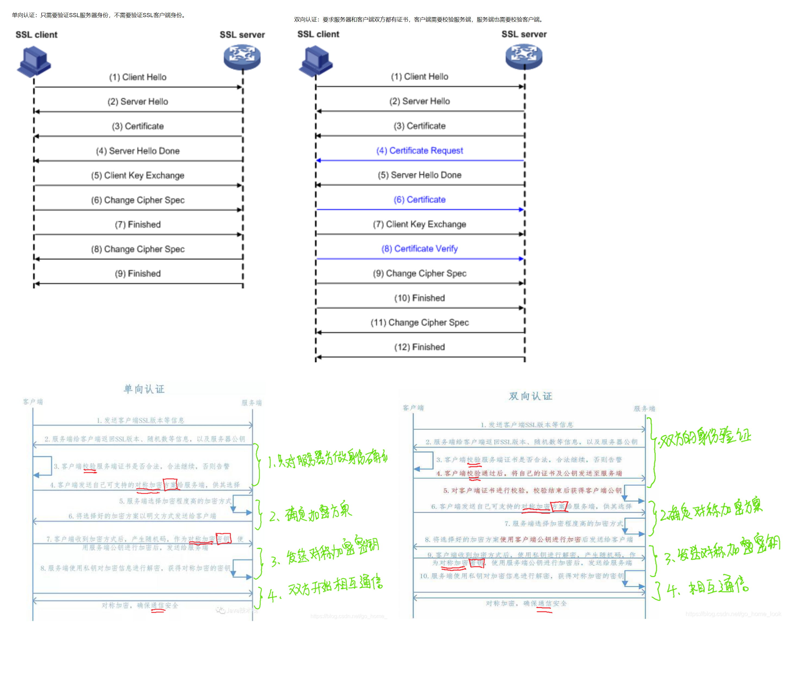

# SSL：
Secure Socket Layer，安全套接字层，它位于TCP层与Application层之间。提供对Application数据的加密保护（密文），完整性保护（不被篡改）等安全服务，它缺省工作在TCP 443 端口，一般对HTTP加密，即俗称的HTTPS。

# TLS：
Transport Layer Secure，更关注的是提供安全的传输服务，它很灵活，如果可能，它可以工作在TCP，也可以UDP （DTLS），也可以工作在数据链路层，比如802.1x EAP-TLS。

# 

# 根证书。
根据颁发者的名字搜索根证书目录，
根证书目录，一个是系统自带的，在安装系统时就固定配置了一些证书，比如Debian下就是放在/etc/ssl/certs/ca-certificates.crt，
一些浏览器可能也自带了一些根证书，在安装浏览器的时候固定配置了证书。
这些目录一般是不更新的，因为公认颁发根证书机构就那几个，基本不会变的。
如果是需要添加一些自签的证书，则可以手动添加。

在证书里一般还会包含这两个地址：
## CRL（Certificate Revocation List）提供一个接口查询哪些证书已经被注销，一般是发错了证书，但证书这个东西又没法收回，只能通过这种方式注销。
## OCSP（Online Certificate Status Protocol）可以实时查询该证书是否还有效，证书是否被注销也可以通过这个接口查询。


# OpenSSL这个库默认情况下不会做证书认证。
在调用OpenSSl实现SSL连接时，我们可以通过SSL_CTX_set_verify来指定是否校验对方的证书。

```cpp
// 一个ctx可以给多个连接使用，因此一个证书就创建一个ctx就可以了
    SSL_CTX *ctx = SSL_CTX_new(method);
    if (!ctx)
    {
        ssl_error("new_ssl_ctx:can NOT create ssl content");
        return -1;
    }

    // 指定了根ca证书路径，说明需要校验对方证书的正确性
    if (ca)
    {
        SSL_CTX_set_verify(ctx, SSL_VERIFY_PEER, nullptr);

        /*加载CA FILE*/
        if (SSL_CTX_load_verify_locations(ctx, ca, nullptr) != 1)
        {
            SSL_CTX_free(ctx);
            ssl_error("load verify fail");
            return -1;
        }
    }
```

当不调用SSL_CTX_set_verify或者参数为SSL_VERIFY_NONE时，表示不校验对方的证书，即连接依然是SSL（数据还是经过加密），但对方的证书可能是无效的（自签的、过期的），这还是有一些应用场景的，比如说H5游戏用自签证书就可以防止别人劫持连接加广告。
当参数为SSL_VERIFY_PEER，在SSL握手时，将会校验对方的证书。校验过程是在SSL握手时进行的，如果校验不通过，SSL握手将失败（SSL_do_handshake返回失败）例如无法验证根证书时.

那启用校验时，OpenSSL不会自动加载/etc/ssl/certs/ca-certificates.crt下的根证书，需要调用SSL_CTX_load_verify_locations去加载。
如果用的是自签证书，则是加载自签根证书而不是系统根证书。它也不会去做CRL和OCSP的检测，但你可以用X509_STORE_add_crl来加载自己已下载的CRL列表，以及OCSP的实现。

```cpp
typedef int (*SSL_verify_cb)(int preverify_ok, X509_STORE_CTX *x509_ctx);
void SSL_CTX_set_verify(SSL_CTX *ctx, int mode, SSL_verify_cb verify_callback);

// 然而在看原码的时候，所谓的default callback是这样的
// x509_vfy.c
static int null_callback(int ok, X509_STORE_CTX *e)
{
    return ok;
}

//这个callback的作用是每次校验证书的时候，触发一次回调，用于做一些自定义的操作，但是这个回调并不影响校验结果的。真正的默认校验函数在
// x59_vfy.c
/* verify the issuer signatures and cert times of ctx->chain */
static int internal_verify(X509_STORE_CTX *ctx)
{
      // ...
}
//可以用X509_STORE_CTX_set_verify_cb来自定义校验函数。
```


```cpp
双向认证客户端

#include <stdio.h>
#include <string.h>
#include <errno.h>
#include <sys/socket.h>
#include <resolv.h>
#include <stdlib.h>
#include <netinet/in.h>
#include <arpa/inet.h>
#include <unistd.h>
#include <openssl/ssl.h>
#include <openssl/err.h>

#define MAXBUF 1024

#define CA_FILE                "/home/waf/keyless/test/cert/CA/cacert.pem"
#define CLIENT_KEY            "/home/waf/keyless/test/cert/client-cert/key.pem"
#define CLIENT_CERT         "/home/waf/keyless/test/cert/client-cert/cert.pem"

void ShowCerts(SSL * ssl)
{
    X509 *cert;
    char *line;
    cert = SSL_get_peer_certificate(ssl);
    if (cert != NULL) {
        printf("数字证书信息:\n");
        line = X509_NAME_oneline(X509_get_subject_name(cert), 0, 0);
        printf("证书: %s\n", line);
        free(line);
        line = X509_NAME_oneline(X509_get_issuer_name(cert), 0, 0);
        printf("颁发者: %s\n", line);
        free(line);
        X509_free(cert);
    } else {
        printf("无证书信息！\n");
    }
}

int main(int argc, char **argv)
{
    int sockfd, len;
    struct sockaddr_in dest;
    char buffer[MAXBUF + 1];
    SSL_CTX *ctx;
    SSL *ssl;
    const SSL_METHOD *method;

    if (argc != 3) {
        printf("参数格式错误！正确用法如下：\n\t\t%s IP地址 端口\n\t比如:\t%s 127.0.0.1 80\n此程序用来从某个"
                "IP 地址的服务器某个端口接收最多 MAXBUF 个字节的消息", argv[0], argv[0]);
        exit(0);
    }

    SSL_library_init();
    SSL_load_error_strings();
    OpenSSL_add_all_algorithms();  
    method = TLSv1_2_client_method();
    ctx = SSL_CTX_new(method);

    if (!ctx) {
        printf("create ctx is failed.\n");
    }

#if 0
    const char * cipher_list = "ECDHE-ECDSA-AES256-GCM-SHA384:ECDHE-RSA-AES256-GCM-SHA384:ECDHE-RSA-AES128-SHA256:AES128-GCM-SHA256:RC4:HIGH:!MD5:!aNULL:!EDH";
    if (SSL_CTX_set_cipher_list(ctx, cipher_list) == 0) {
        SSL_CTX_free(ctx);
        printf("Failed to set cipher list: %s", cipher_list);
    }
#endif


/////////////////////////////////////单向认证不需要
    /*设置会话的握手方式*/ 
    SSL_CTX_set_verify(ctx, SSL_VERIFY_PEER | SSL_VERIFY_FAIL_IF_NO_PEER_CERT, 0);

    /*加载CA FILE*/
    if (SSL_CTX_load_verify_locations(ctx, CA_FILE, 0) != 1) {
        SSL_CTX_free(ctx);
        printf("Failed to load CA file %s", CA_FILE);
    }
    if (SSL_CTX_set_default_verify_paths(ctx) != 1) {
        SSL_CTX_free(ctx);
        printf("Call to SSL_CTX_set_default_verify_paths failed");
    }
    /*加载客户端证书*/
    if (SSL_CTX_use_certificate_file(ctx, CLIENT_CERT, SSL_FILETYPE_PEM) != 1) {
        SSL_CTX_free(ctx);
        printf("Failed to load client certificate from %s", CLIENT_KEY);
    }
    /*加载客户端私钥*/
    if (SSL_CTX_use_PrivateKey_file(ctx, CLIENT_KEY, SSL_FILETYPE_PEM) != 1) {
        SSL_CTX_free(ctx);
        printf("Failed to load client private key from %s", CLIENT_KEY);
    }
    /*验证私钥*/
    if (SSL_CTX_check_private_key(ctx) != 1) {
        SSL_CTX_free(ctx);
        printf("SSL_CTX_check_private_key failed");
    }
    /*处理握手多次*/  
    SSL_CTX_set_mode(ctx, SSL_MODE_AUTO_RETRY); 
/////////////////////////////////////单向认证不需要


    if ((sockfd = socket(AF_INET, SOCK_STREAM, 0)) < 0) {
        perror("Socket");
        exit(errno);
    }

    bzero(&dest, sizeof(dest));
    dest.sin_family = AF_INET;
    dest.sin_port = htons(atoi(argv[2]));
    if (inet_aton(argv[1], (struct in_addr *) &dest.sin_addr.s_addr) == 0) {
        perror(argv[1]);
        exit(errno);
    }

    if (connect(sockfd, (struct sockaddr *) &dest, sizeof(dest)) != 0) {
        perror("Connect ");
        exit(errno);
    }

    /*创建SSL*/
    ssl = SSL_new(ctx);
    if (ssl == NULL) {
        printf("SSL_new error.\n");
    }
    /*将fd添加到ssl层*/
    SSL_set_fd(ssl, sockfd);
    if (SSL_connect(ssl) == -1) {
        printf("SSL_connect fail.\n");
        ERR_print_errors_fp(stderr);
    } else {
        printf("Connected with %s encryption\n", SSL_get_cipher(ssl));
        ShowCerts(ssl);
    }

    bzero(buffer, MAXBUF + 1);
    len = SSL_read(ssl, buffer, MAXBUF);
    if (len > 0) {
        printf("接收消息成功:'%s'，共%d个字节的数据\n", buffer, len);
    } else {
        printf("消息接收失败！错误代码是%d，错误信息是'%s'\n", errno, strerror(errno));
        goto finish;
    }
    bzero(buffer, MAXBUF + 1);
    strcpy(buffer, "from client->server");

    len = SSL_write(ssl, buffer, strlen(buffer));
    if (len < 0) {
        printf("消息'%s'发送失败！错误代码是%d，错误信息是'%s'\n", buffer, errno, strerror(errno));
    } else {
        printf("消息'%s'发送成功，共发送了%d个字节！\n", buffer, len);
    }

finish:

    SSL_shutdown(ssl);
    SSL_free(ssl);
    close(sockfd);
    SSL_CTX_free(ctx);
    return 0;
}


//服务端
#include <stdio.h>
#include <stdlib.h>
#include <errno.h>
#include <string.h>
#include <sys/types.h>
#include <netinet/in.h>
#include <sys/socket.h>
#include <sys/wait.h>
#include <unistd.h>
#include <arpa/inet.h>
#include <openssl/ssl.h>
#include <openssl/err.h>

#define MAXBUF 1024

#define CA_FILE                "/home/waf/keyless/test/cert/CA/cacert.pem"
#define SERVER_KEY             "/home/waf/keyless/test/cert/server-cert/key.pem"
#define SERVER_CERT            "/home/waf/keyless/test/cert/server-cert/cert.pem"

int main(int argc, char **argv)
{
    int sockfd, new_fd;
    int reuse = 0;
    socklen_t len;
    struct sockaddr_in my_addr, their_addr;
    unsigned int myport, lisnum;
    char buf[MAXBUF + 1];
    SSL_CTX *ctx;
    const SSL_METHOD *method;

    if (argv[1]) {
        myport = atoi(argv[1]);
    } else {
        myport = 7838;
    }

    if (argv[2]) {
        lisnum = atoi(argv[2]);
    } else {
        lisnum = 2;
    }

    SSL_library_init();
    OpenSSL_add_all_algorithms();
    SSL_load_error_strings();

    method = TLSv1_2_server_method();
    ctx = SSL_CTX_new(method);
    if (ctx == NULL) {
        ERR_print_errors_fp(stdout);
        exit(1);
    }

#if 0
    const char *cipher_list = "ECDHE-ECDSA-AES256-GCM-SHA384:ECDHE-RSA-AES256-GCM-SHA384";
    if (SSL_CTX_set_cipher_list(ctx, cipher_list) == 0) {
        SSL_CTX_free(ctx);
        printf("Failed to set cipher list %s", cipher_list);
    }
#endif

//单向认证需要服务端证书
    /*加载服务端证书*/
    if (SSL_CTX_use_certificate_file(ctx, SERVER_CERT, SSL_FILETYPE_PEM) <= 0) {
        ERR_print_errors_fp(stdout);
        exit(1);
    }
    /*加载服务端私钥*/
    if (SSL_CTX_use_PrivateKey_file(ctx, SERVER_KEY, SSL_FILETYPE_PEM) <= 0) {
        printf("use private key fail.\n");
        ERR_print_errors_fp(stdout);
        exit(1);
    }
    /*验证私钥*/
    if (!SSL_CTX_check_private_key(ctx)) {
        ERR_print_errors_fp(stdout);
        exit(1);
    }

/////////////////////////////////////单向认证不需要
    SSL_CTX_set_verify(ctx, SSL_VERIFY_PEER, 0); //SSL_VERIFY_PEER|SSL_VERIFY_FAIL_IF_NO_PEER_CERT
    /*加载CA FILE*/
    if (SSL_CTX_load_verify_locations(ctx, CA_FILE, 0) != 1) {
        SSL_CTX_free(ctx);
        printf("Failed to load CA file %s", CA_FILE);
    }
    //处理握手多次
    SSL_CTX_set_mode(ctx, SSL_MODE_AUTO_RETRY);
/////////////////////////////////////单向认证不需要


    if ((sockfd = socket(PF_INET, SOCK_STREAM, 0)) == -1) {
        perror("socket");
        exit(1);
    } else {
        printf("socket created\n");
    }

    if (setsockopt(sockfd, SOL_SOCKET, SO_REUSEADDR, &reuse, sizeof(reuse)) < 0){
        printf("setsockopet error\n");
        return -1;
    }

    bzero(&my_addr, sizeof(my_addr));
    my_addr.sin_family = PF_INET;
    my_addr.sin_port = htons(myport);
    my_addr.sin_addr.s_addr = INADDR_ANY;

    if (bind(sockfd, (struct sockaddr *) &my_addr, sizeof(struct sockaddr)) == -1) {
        perror("bind");
        exit(1);
    }
    printf("Server bind success.\n");

    if (listen(sockfd, lisnum) == -1) {
        perror("listen");
        exit(1);
    }
    printf("Server begin to listen\n");

    while (1) {
        SSL *ssl;
        len = sizeof(struct sockaddr);

        if ((new_fd = accept(sockfd, (struct sockaddr *) &their_addr, &len)) == -1) {
            perror("accept");
            exit(errno);
        }

        printf("Server: receive a connection from %s, port %d, socket %d\n", inet_ntoa(their_addr.sin_addr), ntohs(their_addr.sin_port), new_fd);

        ssl = SSL_new(ctx);
        if (ssl == NULL) {
            printf("SSL_new error.\n");
        }

        SSL_set_fd(ssl, new_fd);

        if (SSL_accept(ssl) == -1) {
            perror("accept");
            ERR_print_errors_fp(stderr);
            close(new_fd);
            break;
        }
        printf("Server with %s encryption\n", SSL_get_cipher(ssl));

        bzero(buf, MAXBUF + 1);
        strcpy(buf, "server->client");
        len = SSL_write(ssl, buf, strlen(buf));
        if (len <= 0) {
            printf("消息'%s'发送失败！错误代码是%d，错误信息是'%s'\n", buf, errno, strerror(errno));
            goto finish;
        } else {
            printf("消息'%s'发送成功，共发送了%d个字节！\n", buf, len);
        }

        bzero(buf, MAXBUF + 1);
        len = SSL_read(ssl, buf, MAXBUF);
        if (len > 0) {
            printf("接收消息成功:'%s'，共%d个字节的数据\n", buf, len);
        } else {
            printf("消息接收失败！错误代码是%d，错误信息是'%s'\n", errno, strerror(errno));
        }
finish:
        SSL_shutdown(ssl);
        SSL_free(ssl);
        close(new_fd);
    }

    close(sockfd);
    SSL_CTX_free(ctx);
    return 0;
}
```